# Домашнее задание #1

## [Ссылка на Colab](https://colab.research.google.com/drive/186yPd2k8XY6MS7XH_PiJMSxuwddNEZFw?usp=share_link)

## Для исследования была выбрана клеточная линия `HeLa-S3` и гистоновая метка `H3K9ac`

## Обязательная часть

### FastQC

| 1-ая ChipSeq реплика                                          | 2-ая ChipSeq реплика                                          | Контроль                                                      |
|---------------------------------------------------------------|---------------------------------------------------------------|---------------------------------------------------------------|
| [ENCFF000BDH](./data/ENCFF000BDH_fastqc.html)                 | [ENCFF000BDN](./data/ENCFF000BDN_fastqc.html)                 | [ENCFF000BAO](./data/ENCFF000BAO_fastqc.html)                 |
| [ENCFF000BDH trimmed](./data/ENCFF000BDH_trimmed_fastqc.html) | [ENCFF000BDN trimmed](./data/ENCFF000BDN_trimmed_fastqc.html) | [ENCFF000BAO trimmed](./data/ENCFF000BAO_trimmed_fastqc.html) |
| 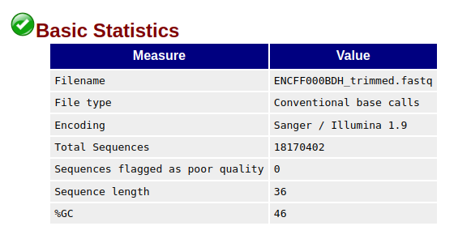                        | 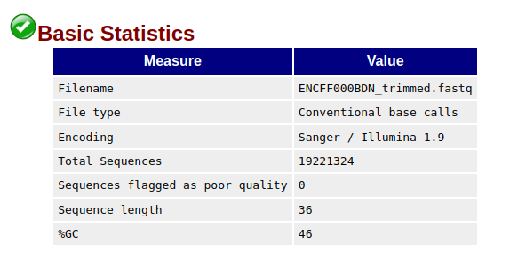                        | 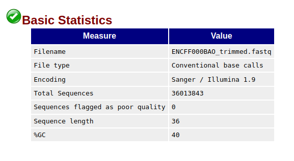                        |
| 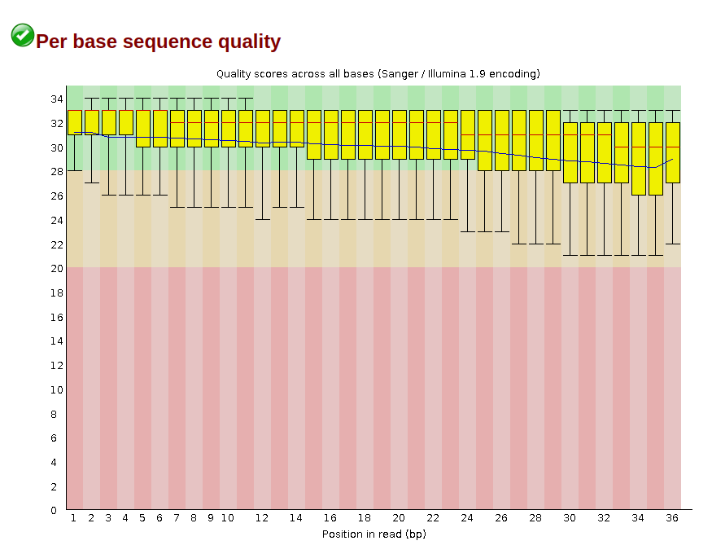                        | 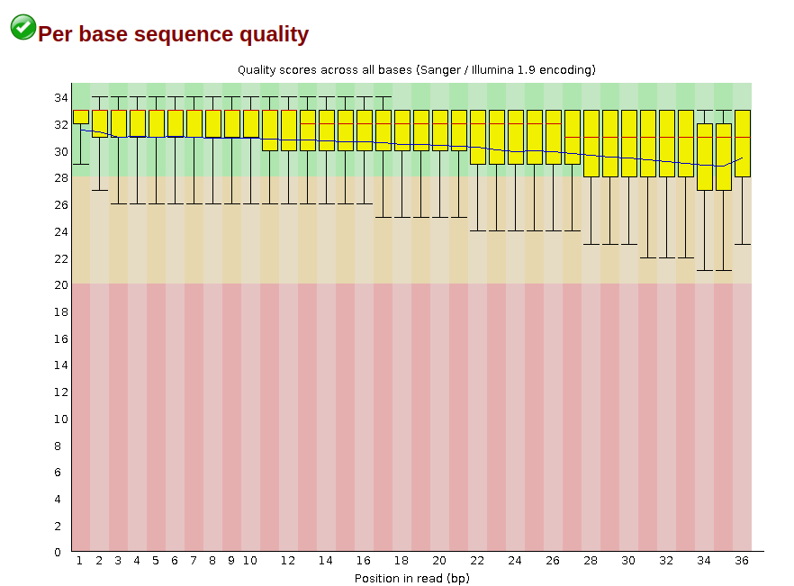                        | 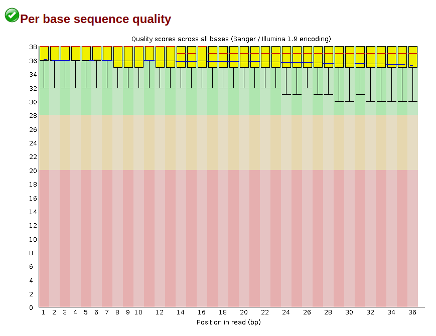                        |
| 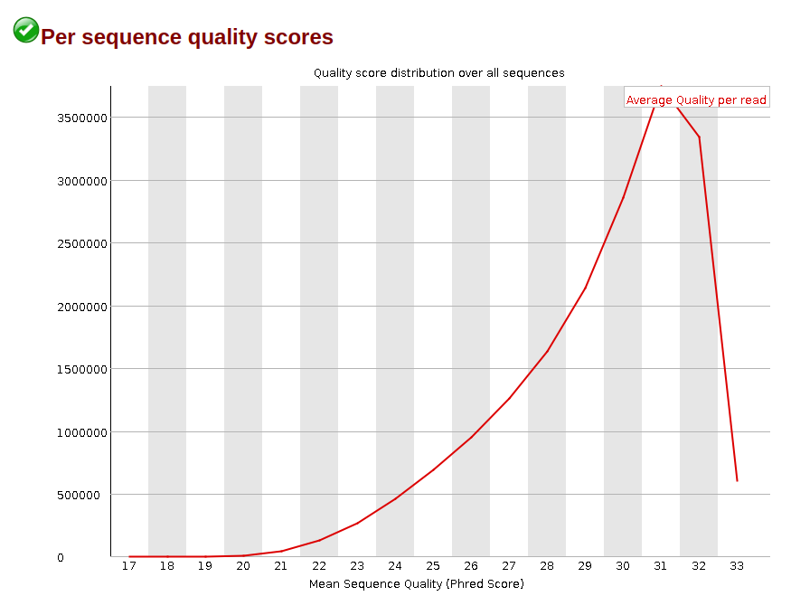                        | 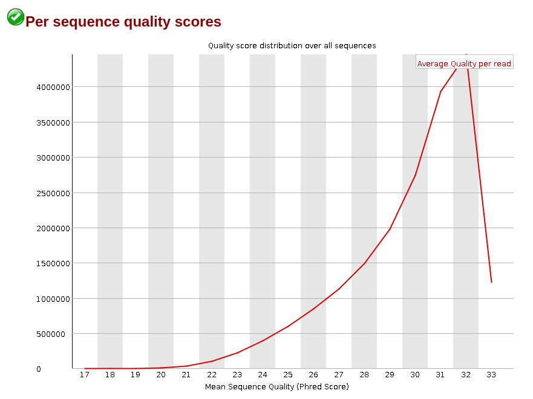                        | 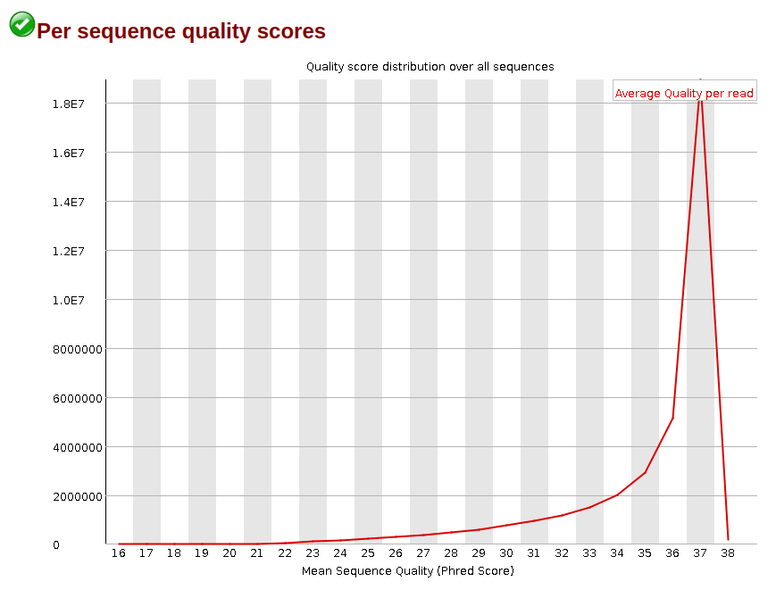                        |
| 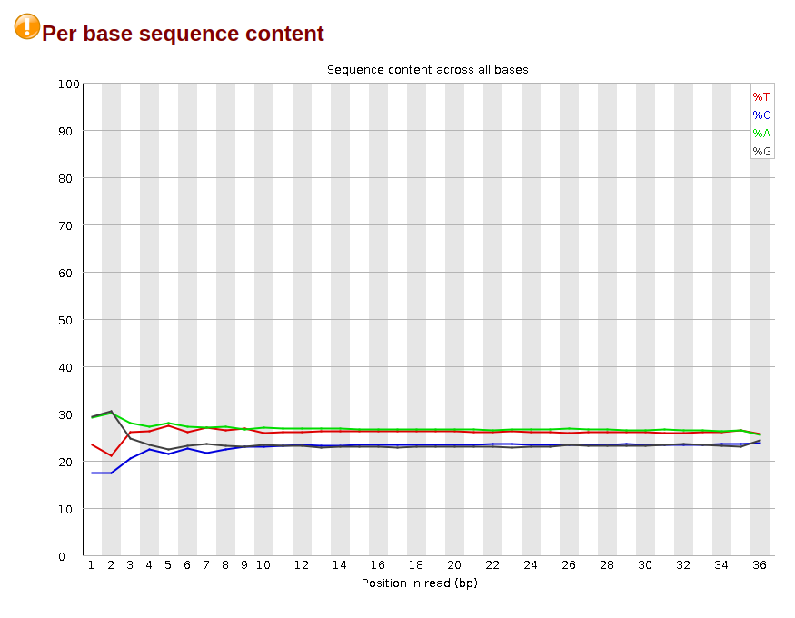                        | 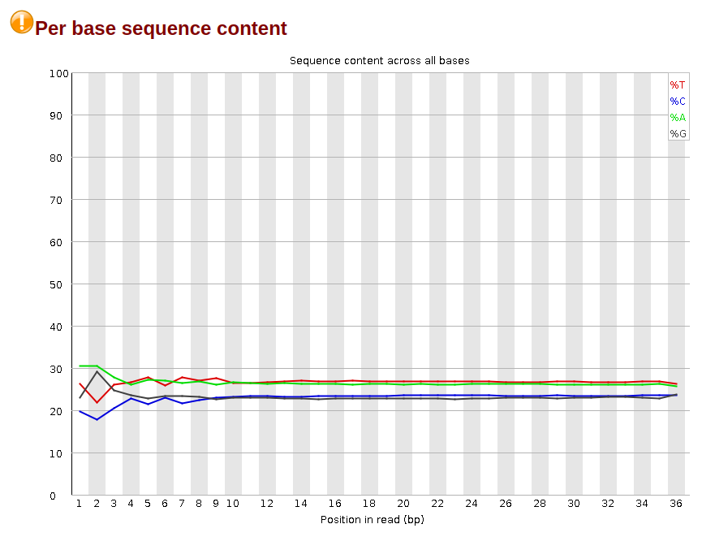                        | 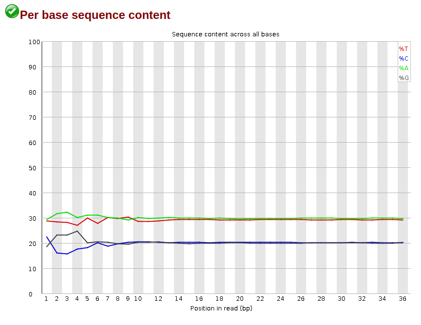                        |
| 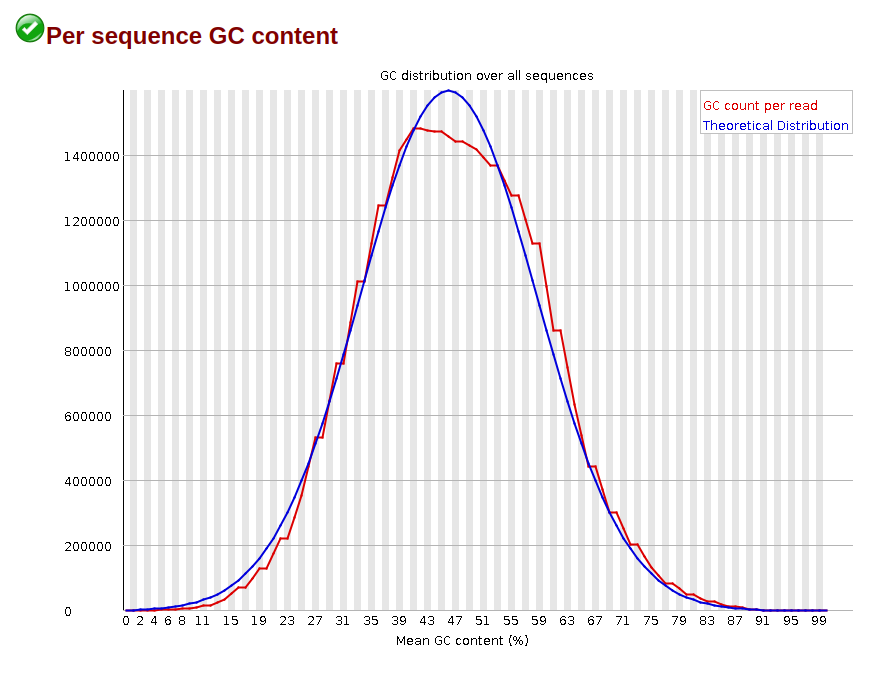                        | 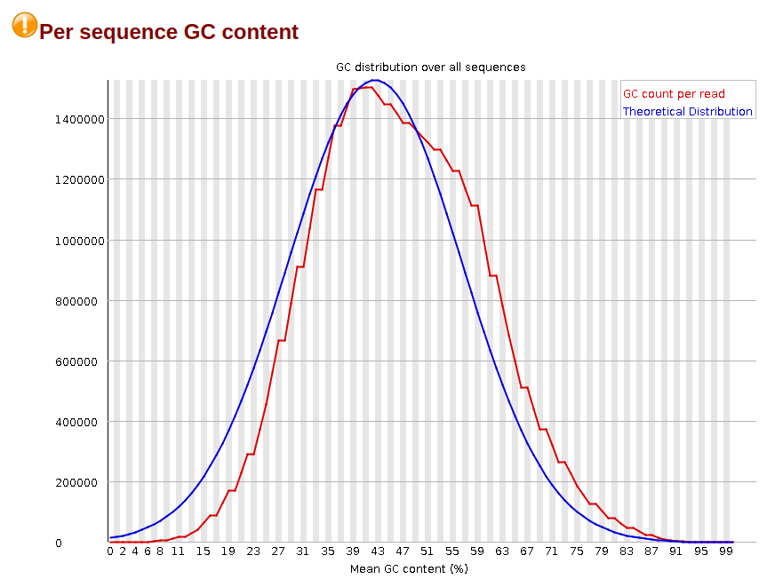                        | 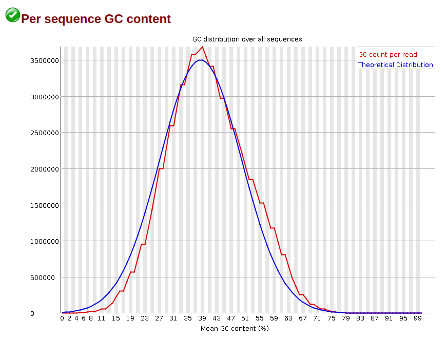                        |
| 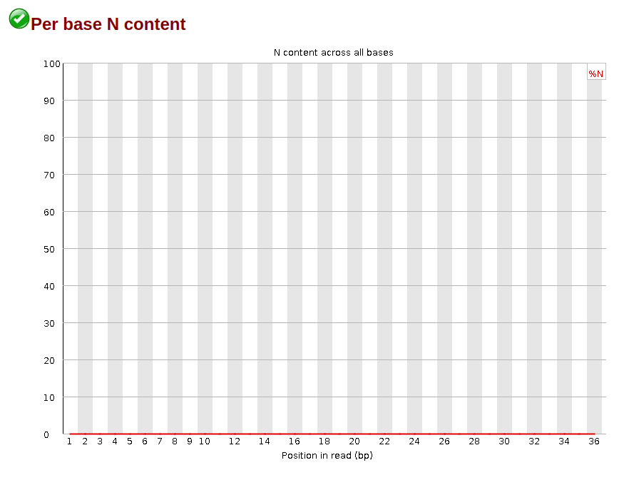                        | 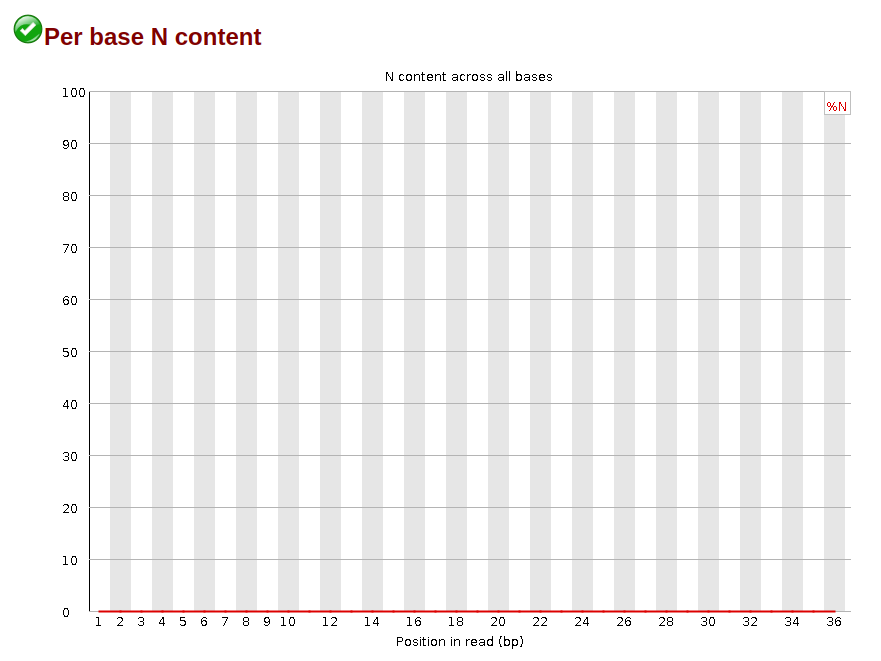                        | 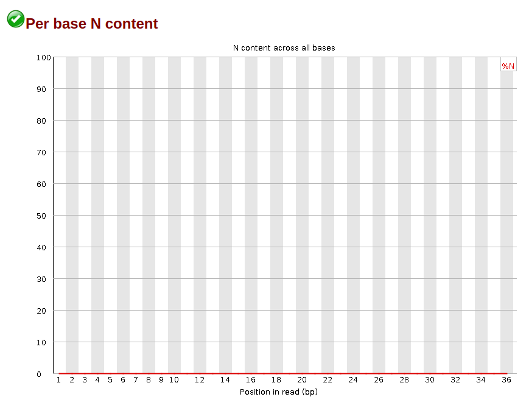                        |

### Таблица со статистикой по выравниванию на 16 хромосому

|               | Всего ридов | Выровненные уникально | (%)  | Выровненные неуникально | (%)   | Не выровненные | (%)   |
|---------------|-------------|-----------------------|------|-------------------------|-------|----------------|-------|
| `ENCFF000BDH` | 18170402    | 772724                | 4.25 | 2427024                 | 13.36 | 14970654       | 82.39 |
| `ENCFF000BDN` | 19221324    | 806091                | 4.19 | 2364883                 | 12.30 | 16050350       | 83.50 |
| `ENCFF000BAO` | 36013843    | 1619342               | 4.50 | 4592356                 | 12.75 | 29802145       | 82.75 |

### Диаграммы Эйлера-Венна

| 1 реплика с ENCODE                | ENCODE с 1 репликой               |
|-----------------------------------|-----------------------------------|
| 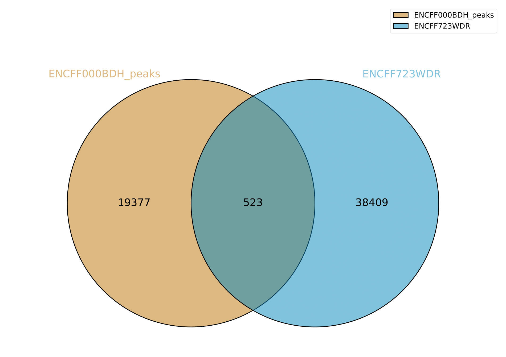 |  |

| 2 реплика с ENCODE                | ENCODE и 2 репликой               |                                                                                         
|-----------------------------------|-----------------------------------|
|  |  |

Пересечений довольно мало, так как выравнивание производилось только на одну хромосому
